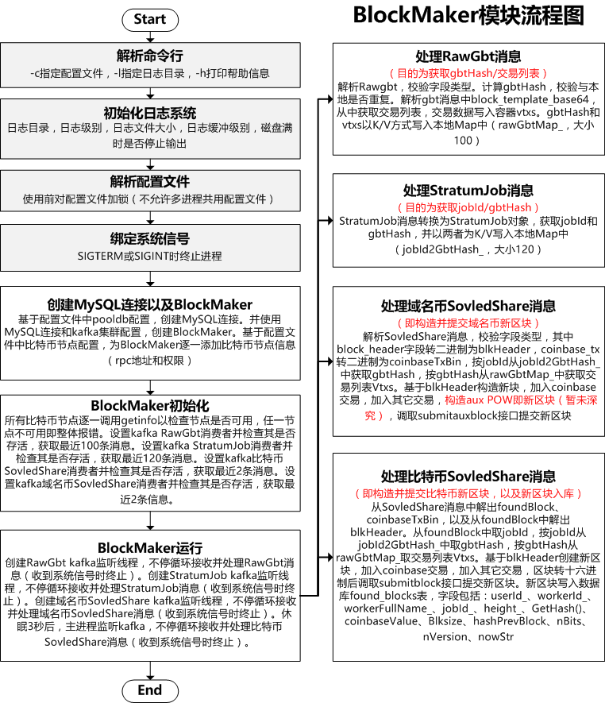

# btcpool矿池-BlockMaker模块解析

### BlockMaker命令使用

BlockMaker用于监听kafka获取新的比特币区块和域名币区块，同时监听kafka获取Gbt消息和Job消息以构造交易列表，最后拼装完整区块提交给比特币节点。

```
blkmaker -c blkmaker.cfg -l log_dir
#-c指定blkmaker配置文件
#-l指定日志目录
```

### blkmaker.cfg配置文件

```
//比特币节点
bitcoinds = (
{
  rpc_addr    = "";  //rpc地址
  rpc_userpwd = "";  //rpc权限，格式如username:password
}
);

//kafka集群
kafka = {
  brokers = "1.1.1.1:9092,2.2.2.2:9092,3.3.3.3:9092";
};

//mysql配置，用于存储已发现的块
pooldb = {
  host = "";
  port = 3306;
  username = "dbusername";
  password = "dbpassword";
  dbname = "";
};
```

### BlockMaker模块流程图



### 参考文档

暂无。
