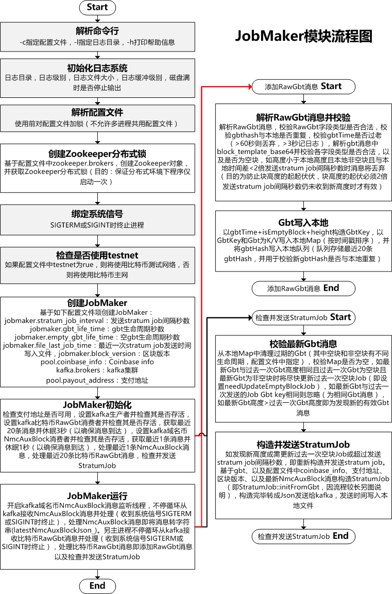
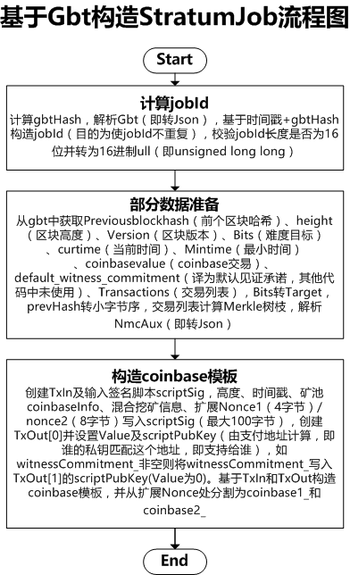

# btcpool矿池-JobMaker模块解析

### 核心机制总结

* 同时监听kafka KAFKA_TOPIC_RAWGBT和KAFKA_TOPIC_NMC_AUXBLOCK，以支持混合挖矿
* 接收的Gbt消息，如果与本地时间延迟超过60秒将丢弃，如果延迟超过3秒将打印log
* 可用的Gbt消息，将以gbtTime+isEmptyBlock+height来构造key写入本地Map，另gbtHash也会写入本地deque（双端队列）
* 本地gbtHash队列仅保存最近20条，本地gbtMap中Gbt消息有效期：非空Gbt有效期90秒，空Gbt有效期15秒，过期将清除
	* 有效期可从配置文件中指定
* Gbt消息如果高度低于本地Gbt高度，且本地Gbt非空，且与本地时间间隔没超过2倍stratumJobInterval_，Gbt消息将丢弃
* 三种情况下将向kafka发送StratumJob：
	* 1、高度大于本地高度（即已发现新块）
	* 2、高度与本地高度相同，但前个Job为空块Job，但新Gbt非空块
	* 3、达到预定的时间间隔20秒（可从配置文件中指定）

### JobMaker命令使用

JobMaker，用于监听kafka获取最新的比特币Gbt消息、以及域名币NmcAuxBlock消息，并用二者构造StratumJob再发送给kafka。

```shell
jobmaker -c jobmaker.cfg -l log_dir
#-c指定jobmaker配置文件
#-l指定日志目录
```

### jobmaker.cfg配置文件

```shell
//是否使用testnet
testnet = true;

jobmaker = {
  //发送stratum job间隔秒数
  stratum_job_interval = 20;

  //gbt生命周期秒数
  gbt_life_time = 90;

  //空gbt（即不含交易）生命周期秒数
  //此值应>=10
  empty_gbt_life_time = 15;

  //最近一次stratum job发送时间写入文件
  file_last_job_time = "/work/xxx/jobmaker_lastjobtime.txt";

  //区块版本，默认为0表示使用bitcoind返回的区块版本
  block_version = 0;
};

//kafka集群
kafka = {
  brokers = "1.1.1.1:9092,2.2.2.2:9092,3.3.3.3:9092";
};

//zookeeper集群
zookeeper = {
  brokers = "1.1.1.1:2181,2.2.2.2:2181,3.3.3.3:2181";
};

pool = {
  //支付地址
  payout_address = "my2dxGb5jz43ktwGxg2doUaEb9WhZ9PQ7K";
  //coinbase info
  coinbase_info = "region1/Project BTCPool/";
};
```

### JobMaker流程图



### 基于Gbt构造StratumJob流程图



另附StratumJob数据结构定义：

```c++
class StratumJob {
public:
  //jobId: timestamp + gbtHash, 目的为保证不重复
  uint64_t jobId_;
  //gbtHash
  string   gbtHash_;
  //前一个区块哈希
  uint256  prevHash_;
  //前一个区块哈希（小字节序）
  string   prevHashBeStr_;
  //区块高度
  int32_t  height_;
  //coinbase交易
  string   coinbase1_;
  string   coinbase2_;
  //merkle树枝
  vector<uint256> merkleBranch_;

  //区块版本
  int32_t  nVersion_;
  //难度目标
  uint32_t nBits_;
  //时间戳
  uint32_t nTime_;
  //最小有效时间
  uint32_t minTime_;
  //挖矿奖励
  int64_t  coinbaseValue_;
  //见证承诺（如未启用隔离见证，此处为空）
  string   witnessCommitment_;
  //nBits转Target难度目标
  uint256 networkTarget_;

  //域名币混合挖矿
  uint32_t nmcAuxBits_;
  uint256  nmcAuxBlockHash_;
  uint256  nmcNetworkTarget_;
  int32_t  nmcHeight_;
  string   nmcRpcAddr_;
  string   nmcRpcUserpass_;
  //方法定义略
};
```

### 参考文档

* [基于ZooKeeper的分布式锁和队列](https://www.cnblogs.com/luxiaoxun/p/4889764.html)
* [ZooKeeper编程笔记](https://www.cnblogs.com/caosiyang/archive/2012/11/09/2763190.html)
* [ C++11多线程之std::lock_guard](http://blog.csdn.net/nirendao/article/details/50890486)
* [区块链核心技术演进之路——挖矿演进](https://zhuanlan.zhihu.com/p/23558268)
* [比特币开发者指南](http://usyiyi.cn/translate/bitcoin/developer-guide.html)
* [比特币脚本及交易分析 - 智能合约雏形](https://xiaozhuanlan.com/topic/3207619845)