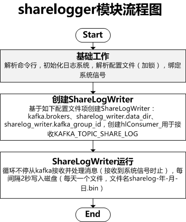

# btcpool矿池-sharelogger模块解析

## sharelogger命令使用

```
sharelogger -c sharelogger.cfg -l log_dir
#-c指定sharelogger配置文件
#-l指定日志目录
```

## sharelogger.cfg配置文件

```
kafka = {
  brokers = "1.1.1.1:9092,2.2.2.2:9092,3.3.3.3:9092";
};

sharelog_writer = {
  //share bin log目录
  data_dir = "/data/sharelog";

  // kafka group id (ShareLog writer use Kafka High Level Consumer)
  kafka_group_id = "sharelog_write_01";
};
```

## sharelogger流程图



