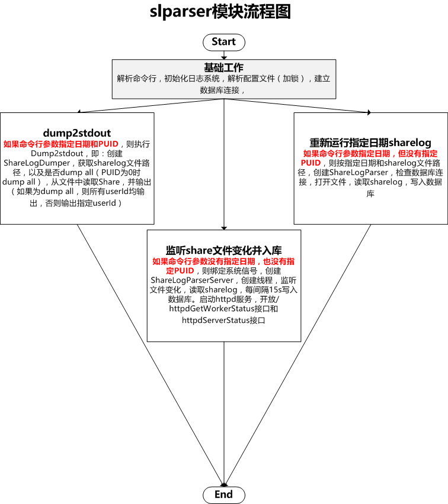

# btcpool矿池-slparser(share log parser)模块解析

## 核心机制总结

* 支持三种功能：
	* 指定Date和UID，将打印指定日期指定用户的share信息到stdout
		* UID=0时，将打印指定日期所有用户的share信息
	* 指定Date但未指定UID，读取指定日期sharelog，统计数据并写入数据库
		* 按Worker、user、pool三个维度统计:Accept1h、Accept1d、score1h、score1d、Reject1h、Reject1d
		* 数据库仅保留最近3个月统计数据
	* 如果Date和UID均未指定，将监听文件变化，读取share并统计数据，每15秒写入数据库
		* 同时启动Httpd服务，开放ServerStatus和WorkerStatus


## slparser命令使用

```shell
slparser -c slparser.cfg -l log_dir
slparser -c slparser.cfg -l log_dir2 -d 20160830
slparser -c slparser.cfg -l log_dir3 -d 20160830 -u puid
#-c指定slparser配置文件
#-l指定日志目录
#-d指定日期
#-u指定PUID（即userId），userId为0时dump all, >0时仅输出指定userId的sharelog
```

## bpool_local_stats_db数据库结构

[bpool_local_stats_db.txt](bpool_local_stats_db.txt)

## slparser.cfg配置文件

```shell
slparserhttpd = {
  #指定IP和端口
  ip = "0.0.0.0";
  port = 8081;

  #每间隔15s写库
  flush_db_interval = 15;
};

#指定sharelog文件路径
sharelog = {
  data_dir = "/data/sharelog";
};

#数据库配置，表为table.stats_xxxx
pooldb = {
  host = "";
  port = 3306;
  username = "dbusername";
  password = "dbpassword";
  dbname = "";
};
```

## slparser流程图



## 入库SQL

```c++
void ShareLogParser::flushHourOrDailyData(const vector<string> values,
                                          const string &tableName,
                                          const string &extraFields) {
  string mergeSQL;
  string fields;

  // in case two process use the same tmp table name, we add process id into
  // tmp table name.
  const string tmpTableName = Strings::Format("%s_tmp_%d",
                                              tableName.c_str(), getpid());

  if (!poolDB_.ping()) {
    LOG(ERROR) << "can't connect to pool DB";
    return;
  }

  if (values.size() == 0) {
    LOG(INFO) << "no active workers";
    return;
  }

  // drop tmp table
  const string sqlDropTmpTable = Strings::Format("DROP TABLE IF EXISTS `%s`;",
                                                 tmpTableName.c_str());
  // create tmp table
  const string createTmpTable = Strings::Format("CREATE TABLE `%s` like `%s`;",
                                                tmpTableName.c_str(), tableName.c_str());

  if (!poolDB_.execute(sqlDropTmpTable)) {
    LOG(ERROR) << "DROP TABLE `" << tmpTableName << "` failure";
    return;
  }
  if (!poolDB_.execute(createTmpTable)) {
    LOG(ERROR) << "CREATE TABLE `" << tmpTableName << "` failure";
    return;
  }

  // fields for table.stats_xxxxx_hour
  fields = Strings::Format("%s `share_accept`,`share_reject`,`reject_rate`,"
                           "`score`,`earn`,`created_at`,`updated_at`", extraFields.c_str());

  if (!multiInsert(poolDB_, tmpTableName, fields, values)) {
    LOG(ERROR) << "multi-insert table." << tmpTableName << " failure";
    return;
  }

  // merge two table items
  mergeSQL = Strings::Format("INSERT INTO `%s` "
                             " SELECT * FROM `%s` AS `t2` "
                             " ON DUPLICATE KEY "
                             " UPDATE "
                             "  `share_accept` = `t2`.`share_accept`, "
                             "  `share_reject` = `t2`.`share_reject`, "
                             "  `reject_rate`  = `t2`.`reject_rate`, "
                             "  `score`        = `t2`.`score`, "
                             "  `earn`         = `t2`.`earn`, "
                             "  `updated_at`   = `t2`.`updated_at` ",
                             tableName.c_str(), tmpTableName.c_str());
  if (!poolDB_.update(mergeSQL)) {
    LOG(ERROR) << "merge mining_workers failure";
    return;
  }

  if (!poolDB_.execute(sqlDropTmpTable)) {
    LOG(ERROR) << "DROP TABLE `" << tmpTableName << "` failure";
    return;
  }
}
```
