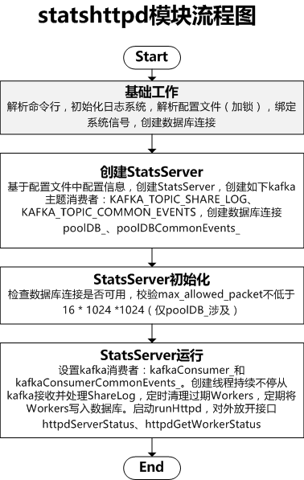

# btcpool矿池-statshttpd模块解析

## statshttpd命令使用

```
statshttpd -c statshttpd.cfg -l log_dir
#-c指定statshttpd配置文件
#-l指定日志目录
```

## statshttpd.cfg配置文件

```
#指定kafka集群
kafka = {
  brokers = "1.1.1.1:9092,2.2.2.2:9092,3.3.3.3:9092";
};

statshttpd = {
  #指定IP和端口
  ip = "0.0.0.0";
  port = 8080;

  #间隔15s将workers data入库
  flush_db_interval = 15;
  #最近一次写库时间
  file_last_flush_time = "/work/xxx/statshttpd_lastflushtime.txt";
};


#指定数据库配置
pooldb = {
  host = "";
  port = 3306;
  username = "dbusername";
  password = "dbpassword";
  dbname = "";
};
```

## statshttpd流程图

